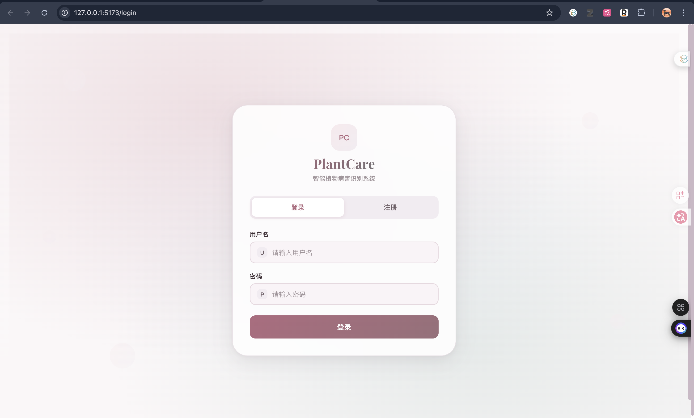
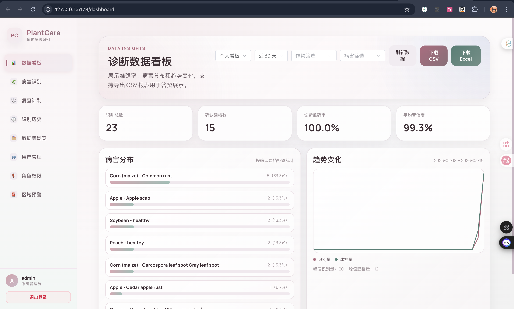
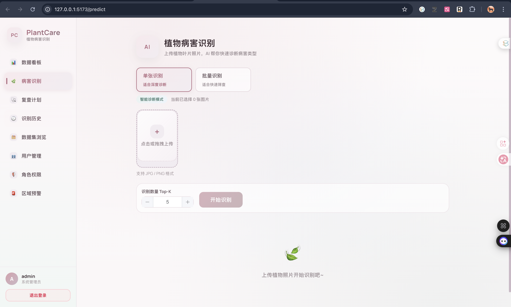
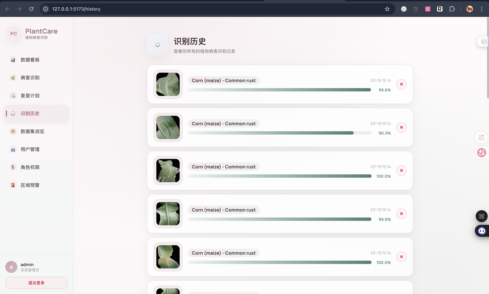
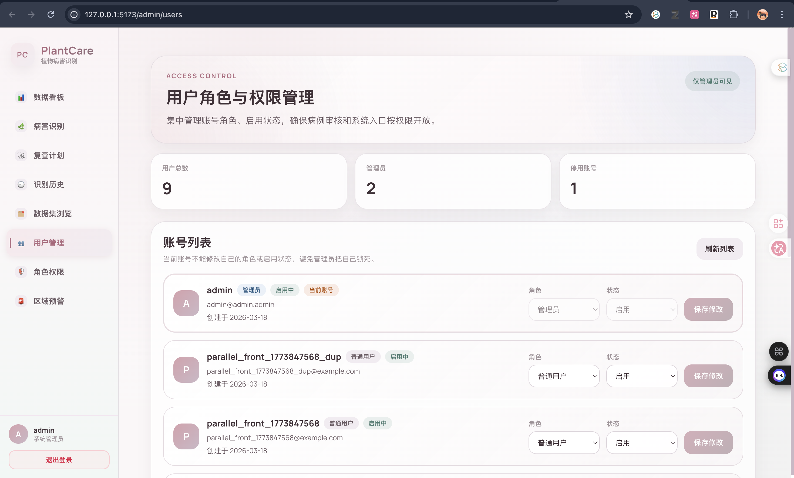
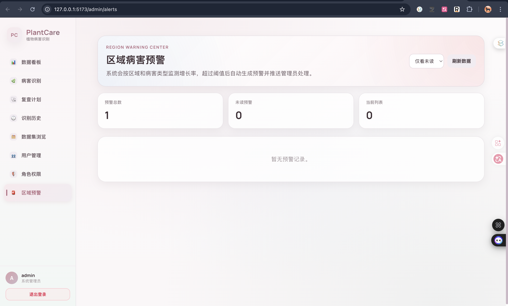

# 植物病害识别系统

基于 ResNet50 的植物病害识别系统，前后端分离架构。

## 技术栈

- **后端**: FastAPI + SQLAlchemy 2.0 (async) + MySQL + JWT
- **前端**: Vue3 + Vite + TypeScript + Element Plus + Pinia
- **模型**: ResNet50 (38类植物病害分类)

## 快速启动

### 1. 数据库

```bash
mysql -u root -e "CREATE DATABASE IF NOT EXISTS plant_disease DEFAULT CHARSET utf8mb4;"
```

### 2. 后端

```bash
cd backend
cp .env.example .env           # 编辑 .env 填写数据库密码
pip install -r requirements.txt
uvicorn app.main:app --reload --port 8000
```

### 3. 前端

```bash
cd frontend
npm install
npm run dev
```

打开 http://localhost:5173 → 注册 → 登录 → 上传图片识别

## 页面截图

### 登录页



### 数据看板



### 病害识别



### 识别历史



### 用户管理



### 区域预警



## API 接口

| 方法 | 路径 | 认证 | 说明 |
|------|------|------|------|
| POST | /api/auth/register | 否 | 注册 |
| POST | /api/auth/login | 否 | 登录 |
| GET | /api/auth/me | 是 | 当前用户 |
| POST | /api/predict | 是 | 单张识别 |
| GET | /api/history | 是 | 识别历史 |
| DELETE | /api/history/{id} | 是 | 删除记录 |
| GET | /api/dataset/categories | 否 | 类别列表 |
| GET | /api/dataset/categories/{name}/images | 否 | 类别图片 |
| GET | /api/health | 否 | 健康检查 |
