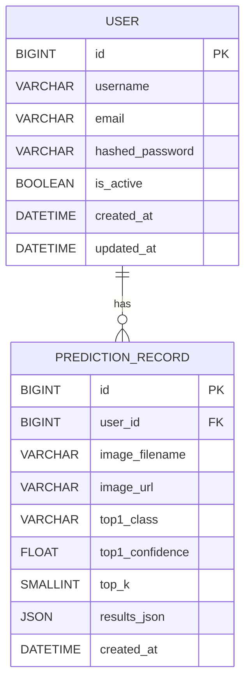
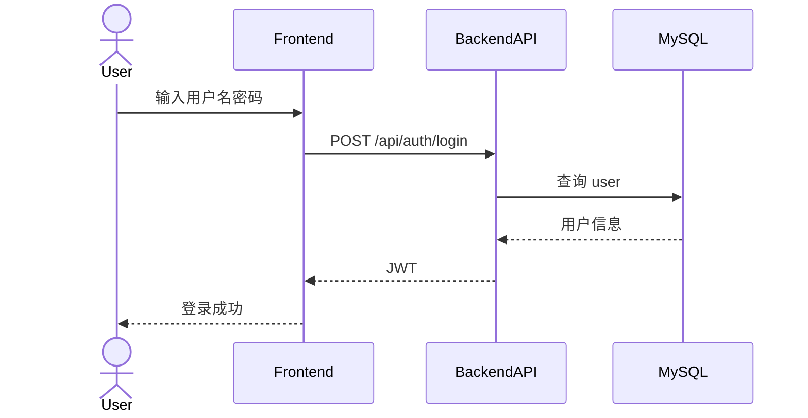
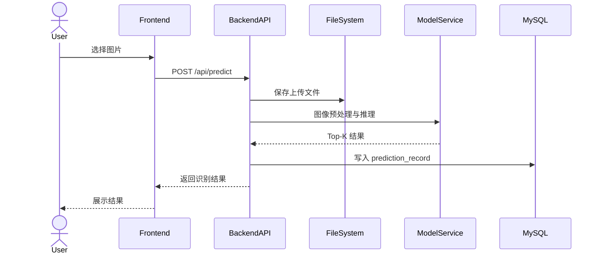
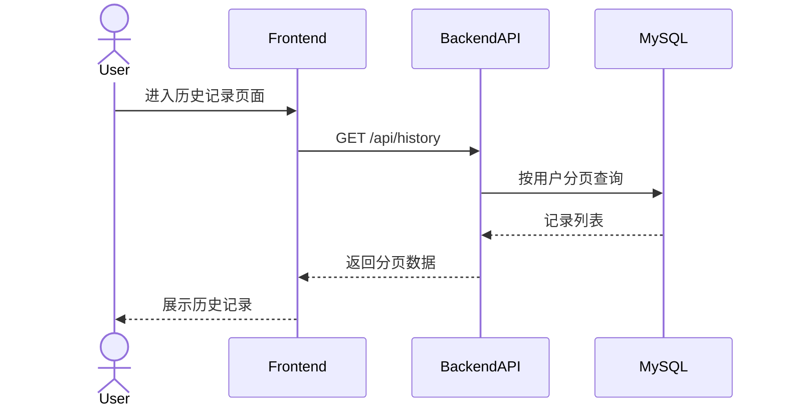

# 植物病害识别系统 设计说明书（毕业论文格式）

本文档基于仓库当前实现整理，覆盖项目结构、数据库设计与概要设计，并补充 ER 图与接口时序图。若后续代码调整，请同步更新本文件。

## 摘要

本系统面向植物病害图像识别场景，采用前后端分离架构，集成 ResNet50 模型，实现用户登录、图像识别、历史记录与数据集浏览。后端以 FastAPI 与异步 SQLAlchemy 构建服务，数据库选用 MySQL，前端采用 Vue3 + Vite + TypeScript，整体具备良好的可扩展性与工程化结构。

关键词：植物病害识别，ResNet50，FastAPI，Vue3，MySQL

## 第 1 章 绪论

### 1.1 研究背景

植物病害诊断依赖人工经验，识别成本高且易受主观影响。利用深度学习模型进行图像识别，能够有效提升诊断效率与一致性。

### 1.2 系统目标

系统目标包括：
- 实现植物病害图像的在线识别
- 支持用户登录、识别记录管理与查询
- 支持数据集类别与样本浏览
- 提供可扩展的后端服务与前端交互界面

### 1.3 技术选型

技术选型如下：
- 后端：FastAPI + SQLAlchemy 2.0（异步）+ MySQL + JWT
- 前端：Vue3 + Vite + TypeScript + Element Plus + Pinia
- 模型：ResNet50（38 类）

### 1.4 运行环境

运行环境要求：
- Python 3.10+（建议）
- Node.js 16+（建议）
- MySQL 8.0+（建议）

## 第 2 章 总体设计

### 2.1 总体架构

系统采用前后端分离架构，前端负责展示与交互，后端负责鉴权、推理与数据管理。模型权重与数据集存储在文件系统中，识别记录与用户信息存入数据库。

### 2.2 功能模块划分

主要功能模块包括：
- 用户认证模块
- 图像识别模块
- 识别记录模块
- 数据集浏览模块
- 系统健康检查模块

### 2.3 数据与资源组织

关键资源位置：
- 模型权重文件：`/Users/mr.chen/Documents/Project/毕设/毕设2/ResNet/resnet50_阶段二_(全局微调)_best.pth`
- 数据集目录：`/Users/mr.chen/Documents/Project/毕设/毕设2/ResNet/datasets/color`
- 上传目录：`/Users/mr.chen/Documents/Project/毕设/毕设2/ResNet/uploads`

## 第 3 章 系统结构设计

### 3.1 项目目录结构

项目根目录：`/Users/mr.chen/Documents/Project/毕设/毕设2/ResNet`

目录树：
```text
/Users/mr.chen/Documents/Project/毕设/毕设2/ResNet
├─ README.md
├─ backend
│  └─ app
│     ├─ main.py
│     ├─ config.py
│     ├─ database.py
│     ├─ dependencies.py
│     ├─ models
│     │  ├─ user.py
│     │  └─ prediction.py
│     ├─ routers
│     │  ├─ auth.py
│     │  ├─ predict.py
│     │  ├─ history.py
│     │  ├─ dataset.py
│     │  └─ health.py
│     ├─ services
│     │  ├─ auth_service.py
│     │  ├─ model_service.py
│     │  ├─ history_service.py
│     │  └─ dataset_service.py
│     ├─ schemas
│     │  ├─ user.py
│     │  ├─ prediction.py
│     │  ├─ dataset.py
│     │  └─ common.py
│     └─ utils
│        └─ security.py
├─ frontend
│  └─ src
│     ├─ main.ts
│     ├─ App.vue
│     ├─ router
│     │  └─ index.ts
│     ├─ api
│     │  ├─ request.ts
│     │  ├─ auth.ts
│     │  ├─ predict.ts
│     │  ├─ history.ts
│     │  └─ dataset.ts
│     ├─ stores
│     │  └─ user.ts
│     └─ views
│        ├─ LoginView.vue
│        ├─ PredictView.vue
│        ├─ HistoryView.vue
│        └─ DatasetView.vue
├─ datasets
│  └─ color
├─ uploads
└─ resnet50_阶段二_(全局微调)_best.pth
```

### 3.2 后端结构说明

后端入口文件：`/Users/mr.chen/Documents/Project/毕设/毕设2/ResNet/backend/app/main.py`

后端生命周期逻辑：
- 启动时自动建表（`Base.metadata.create_all`）
- 加载模型权重
- 确保上传目录存在
- 关闭时释放数据库连接

后端分层说明：
- Router：接口入口与权限控制
- Service：业务逻辑与流程编排
- Model：ORM 表结构定义
- Schema：请求与响应 DTO
- Utils：安全与 JWT

### 3.3 前端结构说明

路由文件：`/Users/mr.chen/Documents/Project/毕设/毕设2/ResNet/frontend/src/router/index.ts`

页面列表：
- 登录注册页：`LoginView.vue`
- 识别页：`PredictView.vue`
- 历史记录页：`HistoryView.vue`
- 数据集浏览页：`DatasetView.vue`

状态管理：`/Users/mr.chen/Documents/Project/毕设/毕设2/ResNet/frontend/src/stores/user.ts`

### 3.4 接口概览

接口概览表：

| 方法 | 路径 | 认证 | 说明 |
|---|---|---|---|
| POST | /api/auth/register | 否 | 注册 |
| POST | /api/auth/login | 否 | 登录 |
| GET | /api/auth/me | 是 | 当前用户 |
| POST | /api/predict | 是 | 单张识别 |
| POST | /api/predict/batch | 是 | 批量识别 |
| GET | /api/history | 是 | 识别历史 |
| DELETE | /api/history/{id} | 是 | 删除记录 |
| GET | /api/dataset/categories | 否 | 类别列表 |
| GET | /api/dataset/categories/{name}/images | 否 | 类别图片 |
| GET | /api/health | 否 | 健康检查 |

## 第 4 章 数据库设计

### 4.1 数据库概述

数据库类型：MySQL

数据库名：`plant_disease`

建库命令：
```bash
mysql -u root -e "CREATE DATABASE IF NOT EXISTS plant_disease DEFAULT CHARSET utf8mb4;"
```

### 4.2 概念结构设计（ER 图）



### 4.3 逻辑结构设计

实体：
- User（用户）
- PredictionRecord（识别记录）

关系：
- User 1:N PredictionRecord

说明：当前实现中未显式声明外键约束，逻辑关系由应用层维护。

### 4.4 物理表结构设计

表：`user`

| 字段 | 类型 | 约束 | 说明 |
|---|---|---|---|
| id | BIGINT | PK, 自增 | 用户主键 |
| username | VARCHAR(50) | UNIQUE, NOT NULL | 用户名 |
| email | VARCHAR(120) | UNIQUE, NOT NULL | 邮箱 |
| hashed_password | VARCHAR(255) | NOT NULL | 密码哈希 |
| is_active | BOOLEAN | DEFAULT true | 是否可用 |
| created_at | DATETIME | DEFAULT now() | 创建时间 |
| updated_at | DATETIME | DEFAULT now(), onupdate | 更新时间 |

表：`prediction_record`

| 字段 | 类型 | 约束 | 说明 |
|---|---|---|---|
| id | BIGINT | PK, 自增 | 记录主键 |
| user_id | BIGINT | INDEX, NOT NULL | 关联用户 |
| image_filename | VARCHAR(500) | NOT NULL | 文件名 |
| image_url | VARCHAR(500) | NOT NULL | 图片 URL |
| top1_class | VARCHAR(200) | NOT NULL | Top1 类别 |
| top1_confidence | FLOAT | NOT NULL | Top1 置信度 |
| top_k | SMALLINT | DEFAULT 5 | Top-K 数量 |
| results_json | JSON | NOT NULL | 结果明细 |
| created_at | DATETIME | DEFAULT now() | 识别时间 |

### 4.5 索引与约束

索引：
- `idx_user_created(user_id, created_at)`
- `prediction_record.user_id` 单列索引

约束：
- `user.username` 唯一约束
- `user.email` 唯一约束

## 第 5 章 概要设计

### 5.1 模块功能设计

用户认证模块：
- 支持注册、登录、JWT 签发与校验

图像识别模块：
- 负责模型加载、图像预处理与推理输出

识别记录模块：
- 负责识别记录保存、分页查询与删除

数据集浏览模块：
- 负责类别列表读取与图片分页展示

### 5.2 关键业务流程

注册与登录流程：
1. 前端提交用户名与密码
2. 后端查询用户与校验密码
3. 登录成功签发 JWT
4. 前端保存 token 并获取用户信息

单张识别流程：
1. 前端上传图片文件
2. 后端保存文件并读取为图像
3. 模型推理输出 Top-K
4. 结果落库并返回

批量识别流程：
1. 前端上传多张文件
2. 后端逐张保存与推理
3. 逐条落库并返回结果数组

历史记录流程：
1. 前端请求历史列表
2. 后端按用户分页查询
3. 返回分页数据

数据集浏览流程：
1. 前端请求类别列表
2. 后端读取数据集目录并统计数量
3. 按类别分页返回图片

### 5.3 接口时序图

登录时序图：


单张识别时序图：


历史记录查询时序图：


### 5.4 数据流与接口返回结构

统一返回结构：`ApiResponse`

字段说明：
- `code` 表示业务状态，0 为成功
- `message` 提示信息
- `data` 业务数据

分页结构：`PageData`

字段说明：
- `items` 列表
- `total` 总数
- `page` 当前页
- `size` 每页大小
- `pages` 总页数

返回示例：
```json
{
  "code": 0,
  "message": "ok",
  "data": {
    "items": [],
    "total": 0,
    "page": 1,
    "size": 20,
    "pages": 0
  }
}
```

## 第 6 章 运行与部署说明

后端启动：
```bash
cd /Users/mr.chen/Documents/Project/毕设/毕设2/ResNet/backend
cp .env.example .env
pip install -r requirements.txt
uvicorn app.main:app --reload --port 8000
```

前端启动：
```bash
cd /Users/mr.chen/Documents/Project/毕设/毕设2/ResNet/frontend
npm install
npm run dev
```

访问地址：
- 前端：`http://localhost:5173`
- 后端：`http://localhost:8000`

## 第 7 章 小结

本文档完成了系统结构、数据库设计与概要设计的详细说明，并补充 ER 图与接口时序图，为后续实现与论文撰写提供一致的结构化依据。

